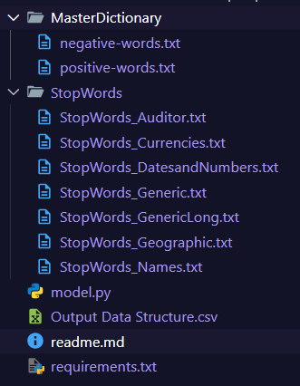

# Data Extraction and NLP Test Assignment

## Problem Statement

Given a set of URLs, the task is to:
1. Extract articles from the web.
2. Perform text analysis to compute various variables.
3. Update the results into Output Data Structure file.

____________________________________________________________________________________________________________________________________________________

## How I Solved this Problem Statement

### Step 1: Article Extraction
To extract text from the given URLs:
- Used the `requests` library to fetch webpage content.
- Used `BeautifulSoup` (from `bs4`) to parse HTML and extract:
   - Main headings (`<h1>` tags).
   - Subheadings (`<strong>` tags).
   - Body paragraphs (`<p>` tags).
- Combined these elements to form the full article text, saved to local `.txt` files for further processing.

### Step 2: Text Preprocessing
To prepare the text for analysis:
- Removed punctuation and converted the text to lowercase for consistency.
- Split the text into sentences and words using Python's `re` library.

### Step 3: Sentiment Analysis
Using pre-defined positive and negative word lists:
- Counted the occurrences of positive and negative words in the text.
- Calculated:
   - **Polarity Score**: `(positive count - negative count) / (positive count + negative count)`.
   - **Subjectivity Score**: `(positive count + negative count) / total words`.

### Step 4: Calculated each variable from the articles documents
- Positive Score
- Negative Score
- Polarity Score
- Subjectivity Score
- Average Sentence Length
- Percentage of Complex Words
- Fog Index
- Average Words per Sentence
- Complex Word Count
- Word Count
- Syllables per Word
- Personal Pronouns
- Average Word Length

### Step 5: Integration with CSV
To consolidate results:
- Used `pandas` to read and update the input CSV file.
- Mapped extracted articles to their respective `URL_ID` in the CSV.
- Added computed metrics as new columns in the CSV.

_________________________________________________________________________________________________________________________________________________________

## How to Run Model.py
1. Python 3.8+
2. Install required libraries using:
    ```bash
    pip install -r requirements.txt
    ```
3. Ensure your current directory contains the necessary files and folders as shown in the image below to run `model.py`:
    
4. Run the script:
    ```bash
    python model.py
    ```

____________________________________________________________________________________________________________________________________________________________

## Project Author

This project was developed by **Satyam Kumar** for **Blackcoffer** as part of an internship.

### Connect with me:
- **LinkedIn**: [linkedin.com/in/isatyamks](https://linkedin.com/in/isatyamks)
- **GitHub**: [github.com/isatyamks](https://github.com/isatyamks)
- **Portfolio**: [isatyamks](https://isatyamks.vercel.app)
- **Email**: [isatyamks@gmail.com](mailto:isatyamks@gmail.com)

_____________________________________________________________________________________________________________________________________________________________
